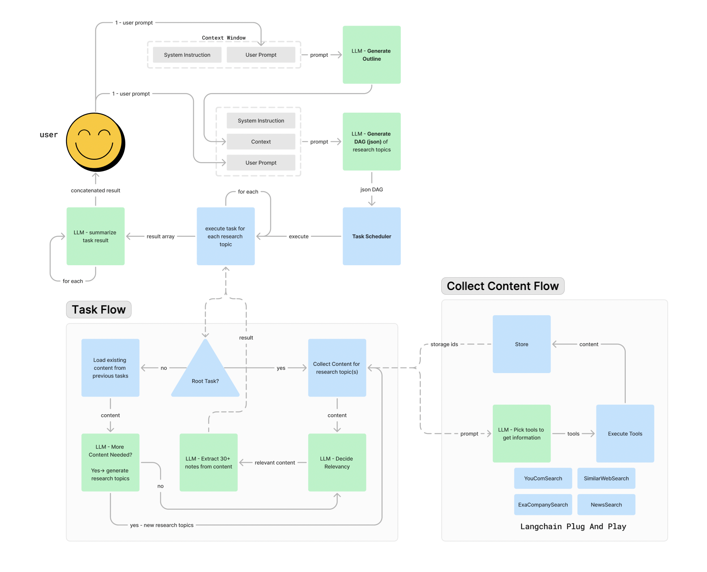

# AI Agent Fundamentals Course

Welcome to the codebase for the AI Agent Fundamentals course. This repository contains all the necessary files and resources for building and understanding AI agents, particularly focusing on the Research Agent V2.

## Agentic Workflow for Research Agent V2

Towards the end of the course, we will build the Research Agent V2. Below is the schema image representing the agentic workflow for this version of the agent.

## Video Demo

For a visual demonstration, you can watch the YouTube video demo of the Research Agent V2:

  

## Agent V2 Trace

You can explore the detailed trace of the Agent V2 at the following link:
[Agent V2 Trace](https://cloud.langfuse.com/project/clvdpeujs0000hl9b7qqzw4n7/traces/ce95336f-418e-41df-8b4f-bf9cef10f364?observation=31f3979a-9c2f-4102-bc02-420744ea2f17&display=details)

## Getting Started

comming soon ...
